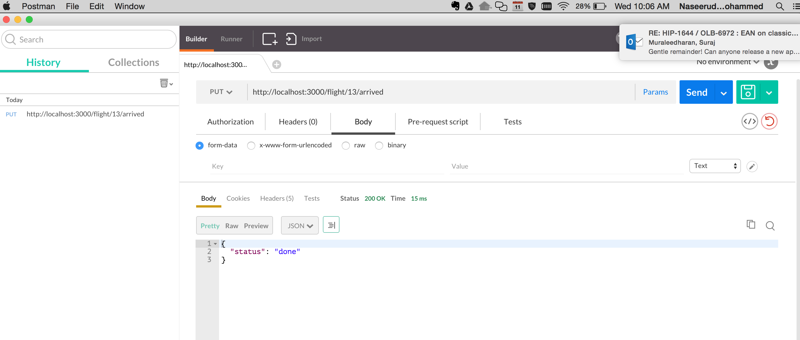
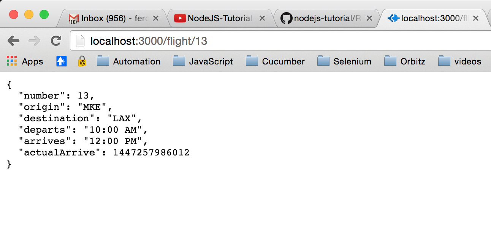

### Chapter07 - Post Method

- In the previous 2 chapters, we have learned how to access server data using http `Get` request. In this chapter, we will look at `Post (or Put)` request.

- By using Post(or Put) request, we want to create a new service that can mark a flight as **Arrived**. 

- To start, we will take code from *chapter06* i.e. all files and folders except `node_modules` folder.

- To download dependencies, use the command `$ npm install`

- Make following changes in app.js file. New service will have verb `arrived` in it.
                
                //file: airlines/app.js 
                app.get('/flight/:number', routes.flight);
                app.put('/flight/:number/arrived',routes.arrived)

- When the new service is called, we will invoke function `arrived` in routes module. Lets see how this functions looks like: 

                exports.arrived = function(req, res){
                        var number = req.param('number');

                        if (typeof flights[number] === 'undefined'){
                                res.status(404).json({status: 'error'});
                        } else {
                                flights[number].triggerArrive();
                                res.json({status: 'done'});
                        }

                 }    

#### Seding Post or Put request

- We will use Chrome addon ***PostMan*** to send put request. See image below

#### Verification

- To verify if the *Put* request was sucessful, check the service <http://localhost:3000/flight/13>  and verify that it contains arrived timestamp

      