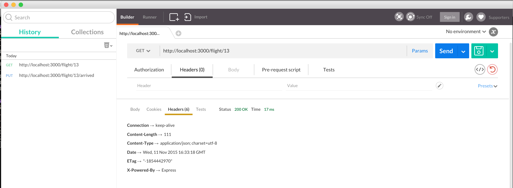

### Chapter08 - Functions that apply to all types of requests

- In the previous tutorial, we had created *flight* function for *Get* request and *arrived* function for *Put* request.

- In this tutorial, we will see how to create a function that is applicable to all types of requests - Get, Put, Post...

- The task : we would like to create a function that will change http response *Header*  parameter

- To start with, copy code from chapter07 except node_modules folder. To download dependencies:

                Nmohammed in ~/mac-workspace/nodejs-tutorial/chapter08/airline (master●)
                $ npm install

#### Header Parameters

- Start the app: 

                Nmohammed in ~/mac-workspace/nodejs-tutorial/chapter08/airline (master●)
                $ node app

- Use *Postman* to send get request and observe response's *Header* parameters

- Observe that **X-Powered-By** is set to **Express**. We will like to create a function that will show **Flight Tracker** instead of **Express**

#### Code Changes

- Insert the following lines of code in **app.js** file:

                app.use(express.methodOverride());
                app.use(function(req, res, next){
                        res.set('X-Powered-By','Flight Tracker');
                        next(); //if this is missing then application will not start correctly
                });
                app.use(app.router);

- Restart the app and send Get, Put or Post request thru Postman and see that the response Header is changed 

