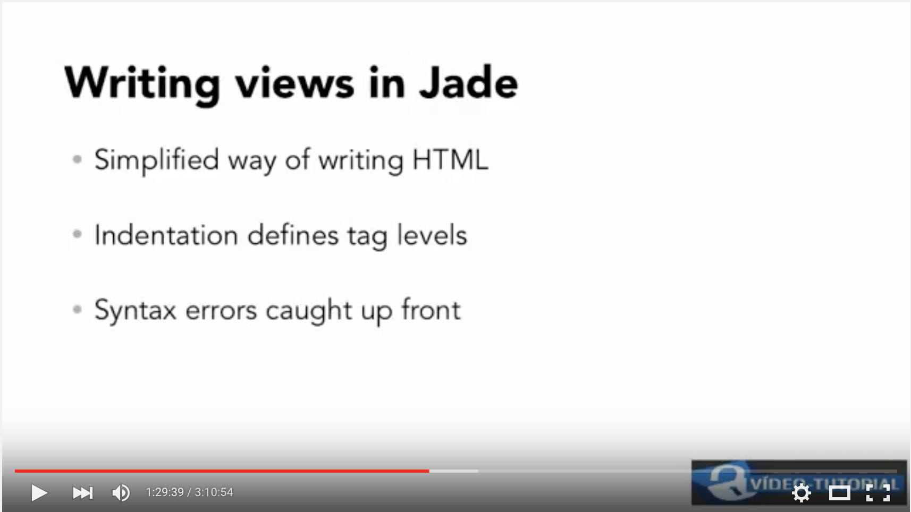
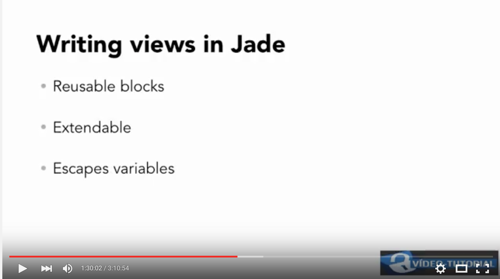
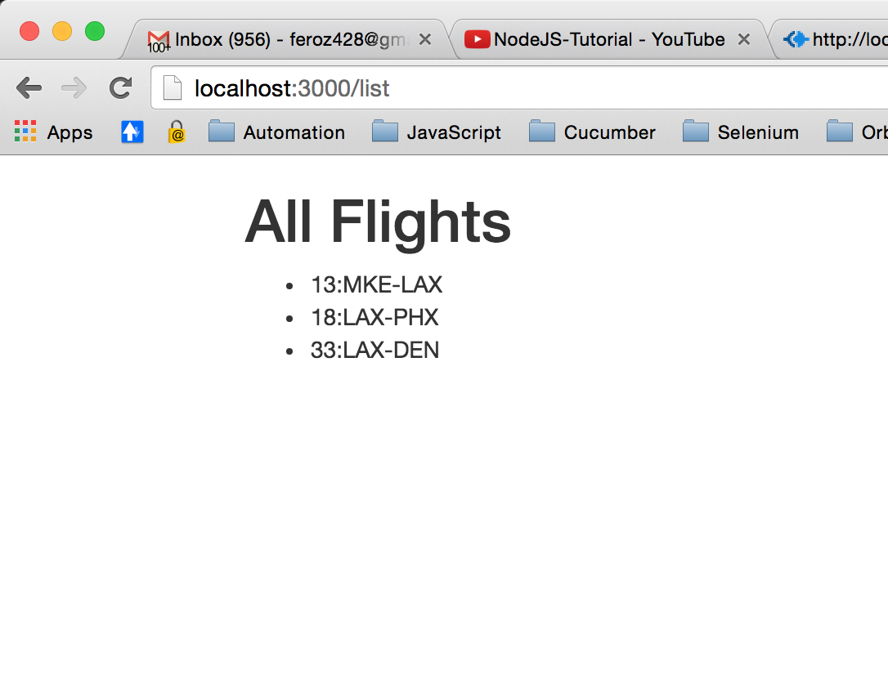

### Templates or HTML Themes

- In this tutorial we will learn how to create HTML template using **jade**.

- In this tutorial, we will be adding files to *public* and *views* folders

- We are reusing code from chapter08. Run the command: `npm install` to download dependencies.

- For styling purpose, we will use *BootStrap CSS* file. 
        
        -  Download bootstrap package from <http://getbootstrap.com/>
        - Unzip the file
        - Select the file: bootstrap-folder>css > bootstrap.min.css and put it in *public* folder

#### Using Jade to write views

- In **views** folder, create new file **layout.jade** with following code. This file defines layout that every screen will be using:

        doctype 5
        html
                head
                        title=title
                        link(rel="stylesheet",href="bootstrap.min.css")
                body
                        div.container
                                block content

- Create second view file **list.jade** for listing all the flights. **Jade allows us to use limited amount of Javascript in the view**
   - index will be object property name
   - flight will be object property value
   - hyphen (**-**) allows us to write raw javascript
   - flight.getInformation is defined inside *flight2* module
        
                extends layout

                block content
                        h1= title
                        ul
                                each flight, index in flights
                                        - flight = flight.getInformation()
                                        li= flight.number +  ':' + flight.origin + '-' + flight.destination

- Next thing we need is to define route for this new view. Edit *airline/app.js* file to add below route:
                
                app.get('/list',routes.list)

- Next, define list function inside routes module
    - render method will render 'list' view
    - we defined two variables inside jade tempate, so pass those values here

                exports.list = function(req, res){
                res.render('list' , {
                    title:"All Flights",
                    flights: flights});
                }

- Lastly, start the app: `node app` and see the result as shown below

