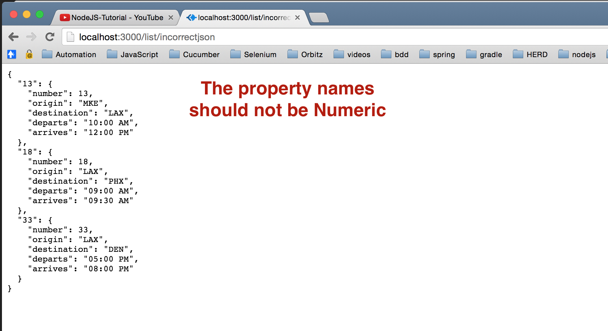

### Chapter10 - Template - part 2

- The code in this chapter has been taken from chapter 09

- In this tutorial we will try to display the flight data in json format in a new path like **/list/json**

#### <CODE>

- First, download dependencies with `npm install`

- We added a new function to routes module:

                exports.listjson = function(req, res){
                    var flightJsonData = [];
                    for (var number in flights){
                        flightJsonData.push(flights[number].getInformation())
                    }
                    res.json(flightJsonData);
                };

- We added new get `/list/json` in *airlines/app.js* file:

                app.get('/list/json',routes.listjson);

- Result will be like below:

- The incorrect way of returning json is present at <http://localhost:3000/list/incorrectjson>

