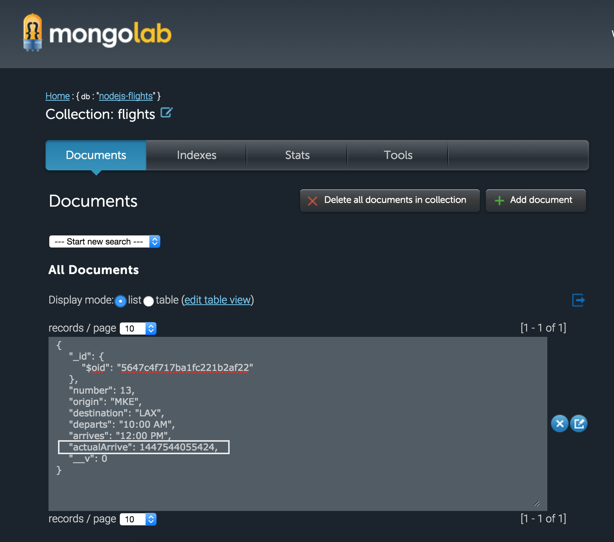

## MongoDB Read/Write

#### writing data to database

- To begin with, whenever `/flight/:number/arrived/` service is called, we want to save the model to database

- Let's start with creating flight schema `flight.js` inside `schemas` folder

- `airline/schemas/flight.js`:
    var mongoose = require('mongoose');

    module.exports = mongoose.model('Flight',{
        number: Number,
        origin: String,
        destination: String,
        departs: String,
        arrives: String,
        actualDepart: Number,
        actualArrive: Number
    });

- Note that we are only exporting the model here but we are NOT connecting to database

- Modify `arrived` method so that we are saving the data when `triggerArrive` method is called

     functions.arrived = function(req, res){
                var number = req.param('number');

                if (typeof flights[number] === 'undefined'){
                        res.status(404).json({status: 'error'});
                } else {
                        flights[number].triggerArrive();
                        
                        //saving flight information to database
                        var record = new FlightSchema(
                            flights[number].getInformation()
                            );
                        record.save(function(err){
                            if(err){
                                console.log(err);
                                res.status(500).json({status: 'failure'});
                            }else{
                                res.json({status: 'success'});
                            }
                        });
                        
                }

        };

- Using *PostMan*, call **put** method with url <http://localhost:3000/flight/13/arrived>

- If the request is successful, then the flight information will be stored on online mongodb. see image below:

#### reading from database

- In this section, we will learn how to read the data from database and display as a service

- We shall create a new service **/arrivals** that will display all the arrived flights from the database.  
Note: In the previous section, we saved flight information to database when actualArrive method was invoked.

- Let's start with defining new routes method *arrivals*
    - we will get flights data from database and pass it as an object to new view **arrivals.jade**
    - the new view **arrivals.jade** is same as earlier view list.jade

    //reading from database
        functions.arrivals = function(req, res){
            //FlightSchema.find(); //this will pull all database records in random order
            FlightSchema.find()
            .setOptions({sort:'actualArrive'}) //sorting data by arrivalTime
            .exec(function(err, dbFlights){ //exec function upon response from DB
                if(err){
                    console.log(err);
                    res.status(500).json({status:'failure'});
                }else{ //if response is success
                    res.render('arrivals',{ //display new view: arrivals
                        title: 'Arrivals', //pass argument: title
                        arrivals: dbFlights //pass argument: DB-Flight-Object
                    });
                }
            });

        };

- output:

1[02](images/02.png)